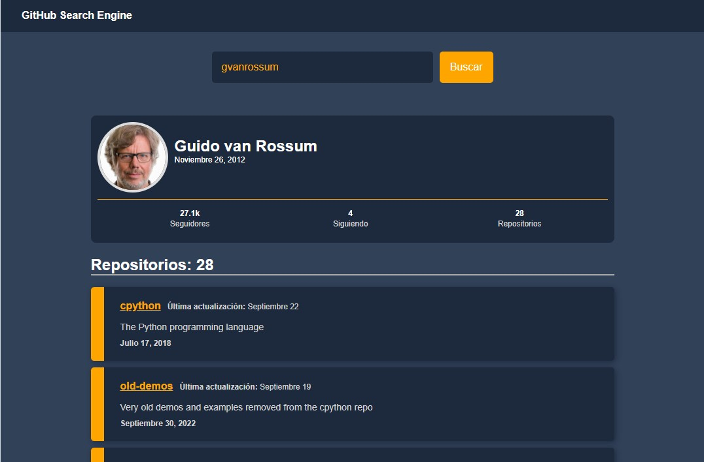
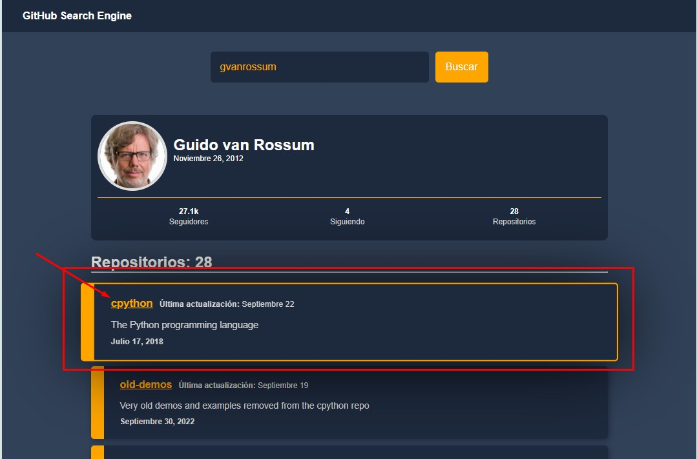
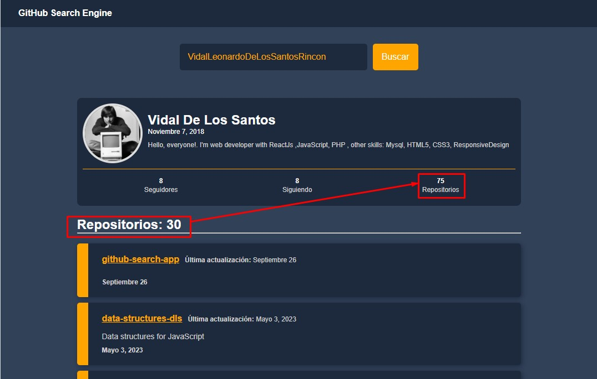

**Autor:** Vidal De Los Santos

**Versión:** 1.0.0

**Última actualización:** 27/09/2026

---
# Manual de Usuario: [GitHub Search App](https://github.com/VidalLeonardoDeLosSantosRincon/github-search-app/tree/master)

## Introducción
### Resumen
Este es un ejemplo básico de una implementación realizada en **Angular 17**  la cual consume el api de **Github** para realizar las busquedes, el propósito de la misma es servir de ejecercio práctico y didáctico basado en parte del conocimiento adquirido en la asignara **Introducción a la Ingenieria II**.

### Sobre el Proyecto
[GitHub Search App](https://github.com/VidalLeonardoDeLosSantosRincon/github-search-app/tree/master) es una aplicación web que permite realizar búsquedas rápidas de perfiles de usuarios de GitHub para consultar sus estadísticas clave y explorar sus repositorios públicos.
##

## Interfaz Principal
- **Barra de Búsqueda:** Campo superior para ingresar el username exacto de GitHub y botón Buscar.

- **Tarjeta de Perfil:** Muestra la foto de avatar, nombre completo (ej. [Guido van Rossum](https://github.com/gvanrossum)), fecha de registro en GitHub y contadores de:

    - **Seguidores.**

    - **Siguiendo.**

    - **Repositorios públicos.**

- **Listado de Repositorios:** Muestra tarjetas individuales con el nombre del proyecto, fecha de última actualización, descripción corta y fecha de creación.

##

## Instrucciones de Uso
Actualmente el app se encuentra desplegada en mi domininio github pages. 

Has click en [https://vidalleonardodelossantosrincon.github.io/github-search-app/](https://vidalleonardodelossantosrincon.github.io/github-search-app/search) para poder iniciar tu interacción.

**Pasos a seguir**

1. Ingresa el nombre de usuario de GitHub en el buscador (ejemplo: gvanrossum).

2. Haz clic en el botón Buscar.

3. La aplicación cargará la información del usuario junto con la lista de sus repositorios.
##

## Demostración y posibles escenerios
1. Ir a la barra de busqueda.  

2. Si se intenta buscar sin colocar ningun nombre.

3. Si se intenta buscar y el nombre de usuario exacto no existe.

4. Si se intenta buscar y se encuentrado el usuario.

5. Si se desea ir al repositorio en Github

6. Si el usuario encontrado tiene más de 30 repositorios públicos, hay que recordar que el api solo retorna 30 repositorios por petición.

En resumen esa sería todo la demostración, a nivel general es un proyecto sencillo y con el que es fácil interactuar.
##

### NOTAS

**Sobre los repositorios**
- Actualmente estoy ordenando los repositorios por fecha de última de actualiazación como lo hace la interfaz official de github, esto el api no lo hace por su cuenta.

- Si hace click sobre el nombre de cualquier repositorio en su tarjeta te saldre una nueva pestaña.

- Por defecto, la API de GitHub devuelve un máximo de 30 repositorios por página. Si el usuario tiene más de 30 repositorios (como en cuentas con cientos de proyectos públicos), la aplicación mostrará únicamente los 30 repositorios más recientes según el orden predeterminado de la consulta.
##